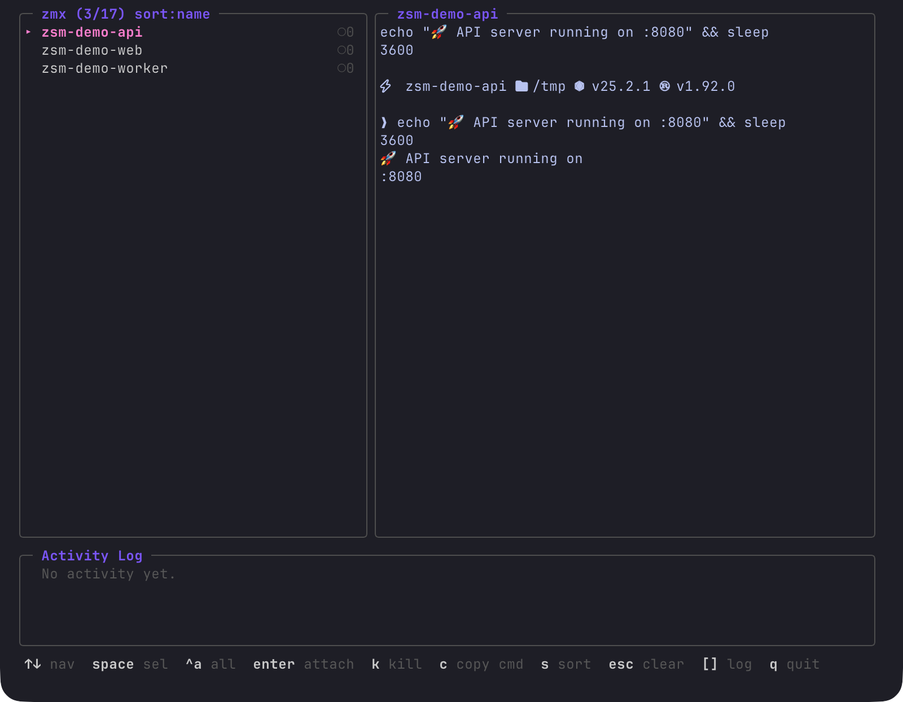

<div align="center">

# zsm

TUI session manager for [zmx](https://github.com/neurosnap/zmx)

[](https://github.com/mdsakalu/zmx-session-manager/actions)
[](https://github.com/mdsakalu/zmx-session-manager/releases/latest)
[](https://github.com/mdsakalu/zmx-session-manager/releases)
[](https://github.com/mdsakalu/homebrew-tap)
[](https://go.dev)
[](https://github.com/mdsakalu/zmx-session-manager)
[](https://github.com/mdsakalu/zmx-session-manager)
[](LICENSE)
[](https://github.com/charmbracelet/bubbletea)



</div>

## Install

### Homebrew

```
brew install mdsakalu/tap/zsm
```

### Go

```
go install github.com/mdsakalu/zmx-session-manager@latest
```

## Requirements

[zmx](https://github.com/neurosnap/zmx) must be installed and available in your `PATH`.

## Key Bindings

| Key | Action |
|-----|--------|
| `↑` `↓` `j` `k` | Navigate sessions |
| `gg` | Jump to first session |
| `G` | Jump to last session |
| `space` | Toggle selection |
| `ctrl+a` | Select / deselect all |
| `enter` | Attach to session |
| `K` | Kill selected session(s) |
| `c` | Copy attach command |
| `s` | Cycle sort mode (name / clients / newest) |
| `/` | Filter sessions |
| `[` `]` | Scroll activity log |
| `q` | Quit |

## License

[MIT](LICENSE)
